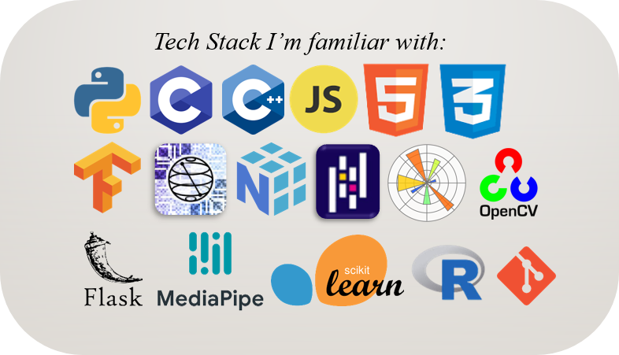

### Hi there, I'm Aryaman
- 🌱 Thanks for landing here!

<!-- - 🤔👯 I’m looking for more exposure in the realm of Quantum Computing, so ping me if you want to collaborate :) -->
<!--
- 🔭 I’m currently working on a dynamically typed compiler for C-lang <a href="https://github.com/cimplec/sim-c">(sim-c)</a>, and a project on elementary cryptography.
-->

- 🔭 I'm interested in the following fields: ML/AI, Data Structures and Algorithms <!-- Quantum Computing -->

<!--
- 📫 Get in touch with me via <a href="https://t.me/Chasmiccoder">Telegram</a>, or email me at: aryamankolhe@acm.org / chasmiccoder@gmail.com
-->

 

  

 

 
<!--
### Programming Languages I love: 

   
### Frameworks I am familiar with:

 -->

 

#### Contact

  
<a href="mailto:aryamankolhe@acm.org">aryamankolhe@acm.org</a>  
<a href="mailto:chasmiccoder@gmail.com">chasmiccoder@gmail.com</a>  

<!--
**Chasmiccoder/Chasmiccoder** is a ✨ _special_ ✨ repository because its `README.md` (this file) appears on your GitHub profile.

Here are some ideas to get you started:

- 🔭 I’m currently working on a dynamically typed compiler for C-lang, Elementary Cryptography, ML, and Quantum Computing
- 🌱 I’m currently learning DSA, C-lang, C++, Python.
- 👯 I’m looking to collaborate on projects related to ML/AI and Quantum Computing
- 🤔 I’m looking for help with more exposure to the realm of Quantum Computing
- 📫 Get in touch with me via <a href="https://t.me/Chasmiccoder">Telegram</a>, or email me at: chasmiccoder@gmail.com

Skills
C
C++
Python
HTML CSS JS
Tensorflow
OpenCV
Mediapipe
Scikit
Numpy
Pandas
Matplotlib
Flask      ?
QuTip ?
Qiskit ?

-->
